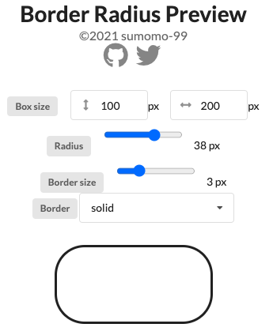

# Broder Radius Preview
スタイル属性のborder-radiusとborderの値を動的に変化させて、見た目を確認するためのサービスです。



## デモURL
[https://border-radius-preview-sumomo-99.vercel.app/](https://border-radius-preview-sumomo-99.vercel.app/)

## 開発サーバの起動
```bash
npm install
npm run dev
```
ブラウザで[http://localhost:3000](http://localhost:3000)にアクセスします。

## ビルド
```bash
npm run build
```